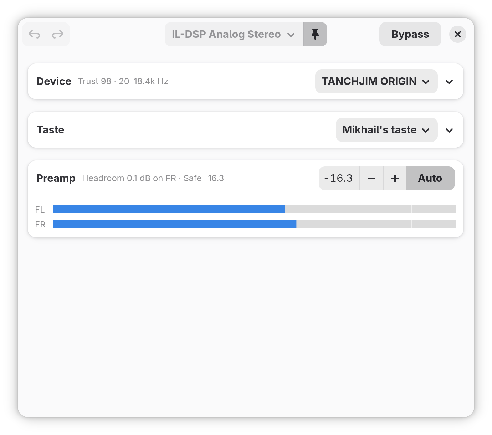

🇬🇧 English version: [README.md](README.md)

# per-device-eq — измерь и скорректируй любое устройство вывода прямо в PipeWire

`per-device-eq` измеряет колонки, наушники или IEM вашим собственным
измерительным ригом, подгоняет к результату параметрический эквалайзер и
применяет его как in-node filter-graph **внутри самого синка** — без
виртуального синка, без лишнего узла в графе, без фонового процесса.
Небольшой хук WirePlumber переприменяет коррекцию всякий раз, когда
устройство начинает играть, так что она переживает перезагрузку, hotplug и
переподключение Bluetooth, и при этом ничего вашего не запущено.

Поверх поустройственной коррекции живёт **слой вкуса**: ваш личный
эквалайзер, накладываемый после активного профиля на любом устройстве и
никогда не трогающий измеренные профили.



Проекты REW, AutoEq и EasyEffects вдохновили этот своим результатом; мне
хотелось той же корректности, но с большим удобством, поэтому весь цикл —
измерить, подогнать, применить, сохранить — живёт в одном приложении.

### Что даёт per-device-eq

- **Встроенное измерение.** Генерация свипа, захват, покапсюльная
  калибровка микрофона, усреднение тейков и ограниченный параметрический
  фит — приложение и есть измерительный прибор. Никакого внешнего
  измерительного софта.
- **Инкрементальные тейки.** Каждый принятый свип сохраняется в момент
  завершения. Добавляйте тейки между сессиями, удаляйте неудачный,
  пересчитывайте фит — профиль только улучшается.
- **По устройствам.** Каждый синк — встроенные динамики, HDMI, конкретная
  Bluetooth-гарнитура (по MAC) — помнит свой эквалайзер и получает его
  обратно автоматически.
- **Вкус отдельно от коррекции.** Именованные слои предпочтений
  («Басхед», по одному на слушателя за общей машиной) едут поверх любого
  профиля и не переключают у профиля метку `edited`.
- **Честный запас.** Общий преамп с подсказкой Safe, посчитанной по
  композиции профиля и вкуса, живой пост-EQ метр и фит, который ложится
  сразу с корректным гейн-стейджингом, а не с клиппингом.
- **Интерактивный редактор.** Ручки бандов прямо на графике, поканальный
  эквалайзер, Bypass для A/B, Undo/Redo (`Ctrl+Z` / `Ctrl+Shift+Z`),
  плашка доверия с Re-fit в один клик.

---

## Требования и установка

**PipeWire ≥ 1.6** (нужен in-node `audioconvert.filter-graph`),
**WirePlumber**, **GTK 4** с **libadwaita ≥ 1.6**, **PyGObject**,
**PyCairo**, **Python 3**. Для измерения и живого метра дополнительно
нужны **python3-numpy**, **python3-scipy** и **python3-soundfile**. В
рантайме приложение зовёт `pw-metadata` и `pw-dump`; если чего-то нет, оно
скажет об этом при запуске.

### Fedora (COPR) — рекомендуемый путь

```
sudo dnf copr enable mikhail/per-device-eq
sudo dnf install per-device-eq
```

Ставятся лаунчер `per-device-eq`, хук WirePlumber (в
`/usr/share/per-device-eq/`) и desktop-запись с иконкой. Запускайте из меню
приложений как **Per-Device EQ** или командой `per-device-eq`. При первом
запуске приложение копирует хук в вашу пользовательскую сессию и один раз
перезапускает WirePlumber; дальше эквалайзер восстанавливается сам при
каждой перезагрузке и переподключении.

### Запуск из исходников

```
# Fedora; в других дистрибутивах те же пакеты под другими именами:
sudo dnf install gtk4 libadwaita python3-gobject python3-cairo \
    python3-numpy python3-scipy python3-soundfile \
    pipewire pipewire-utils wireplumber
git clone https://github.com/NTMan/calibrate-room-rew.git
cd calibrate-room-rew
chmod +x per-device-eq.py
./per-device-eq.py
```

Чтобы при запуске из исходников иметь пункт меню и иконку (обратимо, пишет
только в `~/.local/share`):

```
./per-device-eq.py --install-desktop
./per-device-eq.py --uninstall-desktop
```

### Собрать RPM самому

В репозитории лежит `per-device-eq.spec`. Локальная сборка на Fedora:

```
sudo dnf install rpm-build rpmdevtools desktop-file-utils libappstream-glib
rpmdev-setuptree
git archive --format=tar.gz --prefix=calibrate-room-rew-1.0.0/ \
    -o ~/rpmbuild/SOURCES/calibrate-room-rew-1.0.0.tar.gz v1.0.0
rpmbuild -ba per-device-eq.spec
```

### Flatpak

В планах. Flatpak должен пробросить хук WirePlumber наружу из песочницы,
это отдельная сантехника; пока что COPR — путь «под ключ» на Fedora.

---

# Как измерить устройство

Нужен измерительный риг, в который устройство сможет играть: ушной риг
(miniDSP EARS или купер класса 711) для наушников и IEM либо измерительный
USB-микрофон для колонок, плюс его калибровочные файлы по капсюлям.

1. Подключите риг и посадите на него устройство.
2. В приложении выберите корректируемое устройство вывода, откройте пикер
   профилей и нажмите **+** (New). Правка существующего профиля открывает
   то же окно на *его собственном* устройстве.
3. Назовите профиль, выберите вход **Measurement mic**, число капсюлей
   (моно или стерео, как у EARS) и файл **Calibration** на каждый капсюль.
   Приложение запоминает риг для устройства и в следующий раз заполнит
   всё само.
4. Кликните динамик на кольце, чтобы выбрать канал, и нажмите **play**.
   На паре устройство плюс микрофон, которую приложение видит впервые,
   первое нажатие само охотится за уровнем пробными свипами: достаточно
   горячим для чистого тейка и безопасно далёким от клипа, а если оба
   условия несовместимы, честно отказывает. Дальше уровень запоминается
   на пару; фейдер слева показывает его, а кнопка-линейка забывает
   запомненное и перемеряет здесь и сейчас.
5. Наберите примерно три чистых тейка на канал (чистый помечен зелёной
   точкой; пересаживайте устройство между тейками — разброс между тейками
   и подсказывает фиту, каким частотам верить). Каждый тейк сохраняется в
   момент завершения; корзинка на тейке удаляет его.
6. Карточка над тейками показывает среднюю кривую канала с полосой
   разброса; ручки **EQ range** ниже следуют за доверенной полосой, пока
   вы их не перетащите. **Bands** задаёт бюджет фильтров фита.
7. Закройте окно. Фит считается прямо на графике главного окна с
   поканальным прогресс-баром, ложится с корректным гейн-стейджингом
   (Safe-преамп), и профиль уже играет. Плашка доверия под графиком
   предложит **Re-fit**, когда вы позже добавите или удалите тейки.

### Колонки и UMIK-1

Меряйте в точке прослушивания, микрофон на высоте ушей. miniDSP даёт на
каждый экземпляр два калибровочных файла, и они не взаимозаменяемы: для
коррекции звука в кресле — а этот сценарий ровно про неё — направьте
микрофон **в потолок** и загрузите файл **90°**; когда звук приходит с
разных направлений и от стен, вертикальная ориентация ровнее всего
отвечает на горизонтальные приходы. «Пересадка между тейками» тогда
означает сдвинуть микрофон на ладонь вокруг кресла. Направлять микрофон
**на динамик** с файлом **0°** стоит только для диагностики одного
излучателя по оси, не для коррекции места.

### Вкус: ваш эквалайзер поверх всех устройств

Шестерёнка в заголовке открывает **Preference EQ layers**: именованные,
накрученные руками эквалайзеры, накладываемые после активного профиля на
*каждом* устройстве. Ряд **Taste** над Profile переключает активный слой в
один клик — удобно, когда за машиной по очереди двое. Слои никогда не
меняют измеренные профили, а подсказки запаса считают композицию, так что
басовый шельф сверху не сможет клипануть за спиной у метра.

### Повседневная работа

- **Пикер профилей:** переключает профиль, привязанный к текущему
  устройству; **+** измеряет новый, иконка папки импортирует профиль,
  которым поделился кто-то другой. `Default (no EQ)` — это плоско.
- **Bypass** для A/B с нескорректированным звуком (только на время сессии).
- **Ручная доводка:** тяните точку на графике, клик по пустому месту
  добавляет банд, правый клик убирает; или правьте таблицу. Ручные правки
  помечают фит как `edited`; Re-fit предложит их снести. Доводку под
  вкус лучше делать в слое **Taste**, а не в коррекции устройства: тогда
  коррекции остаются измеренными и все устройства играют одинаково
  правильно.
- **Поканальный эквалайзер:** переключатель *Separate channels* разделяет
  и объединяет FL/FR.

---

## Командная строка

```
./per-device-eq.py --list            # список синков (дефолт помечен *)
./per-device-eq.py --list-profiles   # профили и их привязки к устройствам
./per-device-eq.py --inspect NAME    # параметры синка (node.name)
./per-device-eq.py --apply           # применить привязанные профили сейчас
./per-device-eq.py --install-hook    # (пере)установить хук WirePlumber
```

## Файлы

| Путь                                                             | Что это                                                                   |
| ---------------------------------------------------------------- | ------------------------------------------------------------------------ |
| `~/.config/per-device-eq/profiles/*.json`                        | ваши профили (банды, тейки, метаданные фита)                              |
| `~/.config/per-device-eq/preference-layers.json`                 | слои вкуса и какой из них активен                                         |
| `~/.config/per-device-eq/bindings.json`                          | карта устройство (`node.name`) → профиль                                  |
| `~/.local/share/wireplumber/scripts/90-per-device-eq.lua`        | хук персистентности (статический скрипт, ставится из репозитория как есть)|
| `~/.local/state/wireplumber/per-device-eq`                       | сохранённые хуком графы (пишутся хуком; восстанавливаются на старте)      |
| `~/.config/wireplumber/wireplumber.conf.d/90-per-device-eq.conf` | загружает хук и создаёт объект метаданных `per-device-eq`                 |
| `profiles/clean.json`, `/usr/share/per-device-eq/profiles/`      | встроенные / системные профили                                            |

## Разработка: аудит-инструменты и тесты

Каталог `tools/` содержит инструментарий аудита измерений и клиппинга; план
разработки живёт в [ROADMAP.md](ROADMAP.md). Тесты: `python3 -m pytest
tests/`, фикстуры генерируются на лету и детерминированы. Реальные записи
(включая защищённый авторским правом материал) живут только в
`tests/fixtures-local/` (в gitignore), никогда в репозитории.

## Известные проблемы

- **Просадка громкости после включения EQ (PipeWire).** На части синков с
  аппаратной громкостью первое изменение громкости *после* активации
  in-node EQ может обрушить реальный уровень (при корректно выглядящем
  отображаемом) до перезапуска PipeWire/WirePlumber. Заведено апстриму:
  <https://gitlab.freedesktop.org/pipewire/pipewire/-/work_items/5344>.
  Обход: выставить громкость до включения EQ либо
  `systemctl --user restart wireplumber`.
